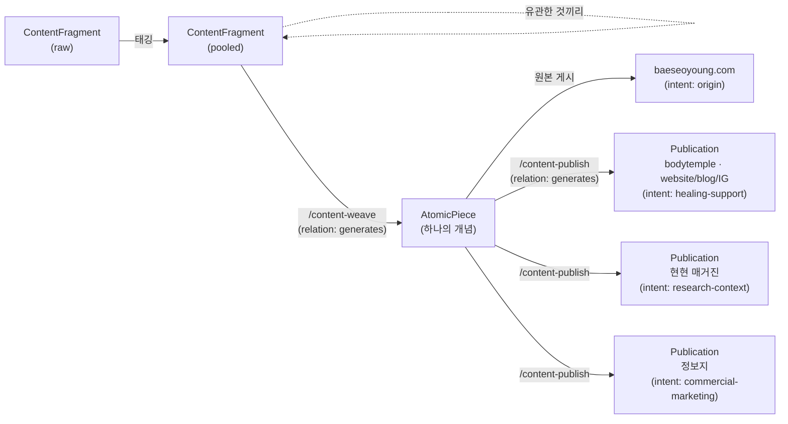

# 콘텐츠 파이프라인 — 개인에게서 흘러나온 글의 배포 구조

*시작: 2026-09-08 | Individual Node 스키마의 첫 실사례*

---

## 이 문서에 대하여

배서영의 개인 콘텐츠 배포 프로세스를 설계하며 만든 문서다.
`docs/design-philosophy.md`가 아직 만들지 않은 Individual Node 스키마를,
"한 사람에게서 흘러나오는 모든 글을 어떻게 쌓고 · 완결시키고 · 여러 형태로 퍼뜨리는가"라는
구체적 사례로 먼저 채워 넣는다. 이 파이프라인은 특정 인물에 종속되지 않는다 — 배서영은 첫 번째 사용자일 뿐이다.

---

## 1. 왜 이런 구조인가

기존 조직 도구는 완성된 콘텐츠의 배포만 다룬다. 이 파이프라인은 그 이전,
**아직 글이 되지 못한 것**부터 다룬다.

```
모든 것의 중심 = 개인 (배서영)
  │
  └─ 흘러나오는 모든 글 → AI에게 전달 → 태깅되어 텍스트 풀에 쌓임
       │
       └─ 유관한 조각들이 엮여 → 하나의 개념만 담은 완결된 글 (원자성)
            │
            └─ 개인 원본 채널에 최초 게시 (baeseoyoung.com)
                 │
                 └─ 형식·성격·의도에 따라 여러 버전으로 파생 게시
                      ├─ 치유적 지지 → 바디템플 (홈페이지/블로그/인스타그램)
                      ├─ 배경 리서치 → 현현 매거진
                      └─ 상업 마케팅 → 정보지
```

핵심은 **원본이 개인에게 있고, 조직/채널은 파생본을 초청받아 가져간다**는 것이다.
`design-philosophy.md` 5장의 "조직이 개인을 초청받는다" 원칙이 콘텐츠 단위에서 그대로 적용된다.

---

## 2. 파이프라인 단계



| 단계 | 스키마 | 상태 전이 | 만드는 스킬 |
|------|--------|-----------|------------|
| 조각 캡처 | `content-fragment.json` | (없음) → `raw` | `/kytos-import` (vault/inbox) 또는 직접 작성 |
| 태깅·안착 | `content-fragment.json` | `raw` → `pooled` | 태깅 시점에 갱신 |
| 엮기 | `atomic-piece.json` | 조각 `pooled` → `woven`, 새 글 `draft` | `/content-weave` |
| 원본 게시 | `atomic-piece.json` | `draft` → `published` | (수동, `baeseoyoung.com`에 게시 후 `origin_url` 기입) |
| 파생 게시 | `publication.json` | (없음) → `draft`/`published` | `/content-publish` |

관계(조각→글, 글→파생본)는 노드 필드가 아니라 `schema/connection-node.json`의
`relation: generates`로 기록한다 — "A 없이는 B가 없다, A는 소비되지 않는다"는 정의가
정확히 들어맞는다. 원본 조각은 그대로 풀에 남고, 여러 개의 완결된 글을 낳을 수 있다.

---

## 3. 채널 분류 (intent × medium)

그녀가 설명한 세 갈래를 스키마 `enum`으로 정리하면:

| org | intent | medium (예) | 성격 |
|-----|--------|-------------|------|
| (없음, 개인) | `origin` | website | 원본. 형식이 가장 자유롭다 |
| bodytemple | `healing-support` | website / blog / instagram | 치유적 활동을 뒷받침하거나 생각을 알림 |
| hyunhyun | `research-context` | magazine | 창작/활동의 배경이 되는 리서치 |
| (상업 채널) | `commercial-marketing` | info-sheet | 상업 활동 마케팅 |

`format`(구체적 형식)은 의도적으로 스키마에서 `null` 허용으로 열어뒀다 —
"아직 어떤 형식이 좋을지는 생각 안 함, 나중에 정해야 함"이라는 현재 상태를 그대로 반영한다.
`/content-publish`는 같은 `org`+`intent`+`medium` 조합의 과거 사례를 참고해 형식을 제안하고,
쌓일수록 그 채널의 형식이 스스로 정착되도록 설계했다.

---

## 4. 캡처 ("하드웨어") — 이미 있는 것을 재사용한다

새 장비가 필요한 게 아니라, 이미 있는 `individual/vault/inbox/` + `/kytos-import` 파이프라인을
콘텐츠 조각 캡처 경로로 그대로 쓴다:

```
음성 메모 / 대화 / 저널 / 즉흥 메모
  → Obsidian vault/inbox/ (또는 다른 캡처 도구)
  → /kytos-import 로 편입하되, 대상이 "인사이트"가 아니라 "글의 재료"이면
    individual/content-pool/ 로 보내고 type: content-fragment 로 태깅한다
```

`content-fragment.json`의 `source` 필드(`journal`, `voice-memo`, `conversation`, ...)가
어떤 경로로 들어왔는지 기록한다. 캡처 도구를 늘리고 싶다면(예: 음성 전사 자동화)
`source`에 값만 추가하면 되고, 스키마 변경은 필요 없다.

---

## 5. 레포 구조 제안

별도 레포로 관리할지, kytos-os 안에서 할지에 대한 판단:

**지금은 kytos-os 안에서 진행한다** — 이 파이프라인은 곧 Individual Node 스키마 자체이고,
`docs/project-structure.md`의 M4가 원래 다음 순서였다. 별도 레포로 먼저 만들면 스키마가
두 곳에서 따로 진화하다 나중에 다시 합치는 비용이 생긴다.

**나중에 분리할 것**: 이 스키마를 "쓰는" 실제 도구 — 예를 들어 baeseoyoung.com에
글을 올리는 CMS, 태깅 UI, 채널별 자동 포맷팅기 — 는 스키마가 아니라 애플리케이션이다.
스키마가 v0.1로 안정되면(`schema/*.json`을 실제로 몇 달 써보고 나면) 그 시점에
`bsy-content-studio` 같은 별도 레포로 분리하고, 이 스키마를 그대로 가져다 쓰게 한다.
검증된 패턴만 나중에 kytos-os에 역으로 편입한다. — 순서는 "여기서 먼저 검증 → 필요하면 분리".

---

## 6. 다음 단계

- [ ] `me.json`을 `/kytos-setup`으로 실제 작성 (short_id: `bsy`)
- [ ] `individual/vault/inbox/`에 기존 글 조각들 넣고 `/kytos-import` → `content-pool/`로 시범 편입
- [ ] `/content-weave`로 첫 AtomicPiece 하나 만들어보기 (실제 원자성 검증)
- [ ] baeseoyoung.com에 게시 후 `/content-publish`로 바디템플용 파생본 1개 시범 제작
- [ ] 형식(format)이 몇 개 쌓이면 채널별 표준 형식을 이 문서 3장 표에 역으로 기록
- [ ] Individual Node 컨테이너 스키마(`schema/individual-node.json`) 설계 — `me.json`이 이미 참조 중
