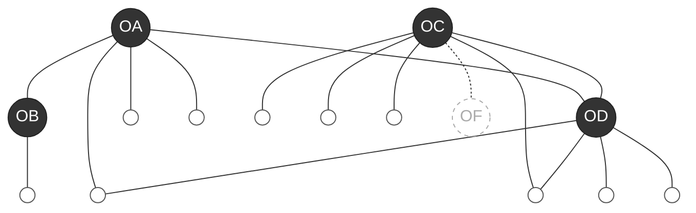

# Kytos OS — 설계 철학과 아키텍처

*시작: 2026-06-08 | 살아있는 문서 — 설계가 진행될수록 업데이트됩니다*

---

## 이 문서에 대하여

결론만이 아니라, 어떻게 이 결론에 도달했는지를 담습니다.
설계 과정의 사고 흐름, 발견, 전환점이 모두 여기에 쌓입니다.

---

## 1. 출발점 — 왜 조직 OS인가

### 원래 비전

> "영혼이 생동하는 사람들이 자연스럽게 모여흐르고,
> 그 흐름이 곧 생산이고 놀이이며 관계가 되는 조직"

현재 대부분의 조직 도구는 **관리(management)** 를 전제한다.
태스크, 마감, 효율. 조직은 조직의 생존을 위해 개인을 '사용'한다.

Kytos OS는 다른 질문에서 출발한다: **조직이 살아있다는 것은 무엇인가?**

생태적 관점에서 보면 답이 보인다.
생태계를 이루는 개체 하나하나의 융성함이 전체를 풍요롭게 만든다.
조직도 마찬가지다. 개개인의 성장과 행복에 관심을 가져야 전체가 살아난다.

### 지금 조직에 없는 것

- 개인의 성장 **과정**이 보이지 않는다
- 결과만 측정된다. 탐색, 시도, 축적은 무시된다
- 그 과정이 조직 안에서 놀이처럼 일어난다는 느낌이 없다
- 과정에서 나온 학습과 영감이 조직에서 꽃필 수 있는 연결고리가 없다

---

## 2. Kytos — 왜 세포인가

κύτος (kytos) — 그리스어. 빈 용기, 세포.
cyto-, -cyte: 모든 세포 관련 용어의 어근.

세포가 조직의 은유가 되는 이유:

| 세포 속성 | 조직 의미 |
|---------|---------|
| 세포막 (경계) | 정체성. 무엇이 이 조직인가 |
| 반투과성 | 선택적 교환. 완전히 닫히지 않음 |
| 내부 소기관 | 역할 분화, 자기조직화 |
| 세포 분열 | 패턴 복제, 새 조직으로 확산 |
| 세포 간 신호 | 조직 간 연결 — Mycelium Network |

**이름 선정 과정**: Mycelium → Spore → Hypha → Soma → Holobiont → Lumen → Theca → Cella → **Kytos**

Cella(공간 은유), Theca(경계·외피 은유)와 비교 후 선택.
이유: 세포 개념 자체의 가장 순수한 담체. 빈 용기 = 가능성을 담는 것.

**최종 비전**: 각 조직(Kytos)이 연결되어 Mycelium Network를 형성한다.

---

## 3. AI와 셀프 피드백 루프

### AI의 실제 작동 방식

모든 LLM의 공통 원리: **추론(inference)과 학습(training)이 분리**된다.

```
학습(training)  → 가중치 업데이트  → 몇 달에 한 번
추론(inference) → 가중치 변하지 않음 → 지금 이 대화
```

AI는 대화 중 '학습'하지 않는다.
"자동 학습"처럼 보이는 것은 전부: **파일에 쓰고 → 다음 세션에 읽는** 구조.

### 셀프 피드백 루프의 실체

```
세션 시작
  └─ 컨텍스트(파일들) 로드 → AI가 아는 전부
       │
  상호작용 (일이 일어남)
       │
  세션 종료
  └─ 추출 → 파일 업데이트
       │
  다음 세션 시작
  └─ 더 풍부한 컨텍스트 로드 → 더 정교한 AI
```

루프가 돌수록 조직이 정교해진다.

### 활성화 명령

```bash
kytos-[조직명]
```

터미널에서 실행하면:
- 해당 조직 디렉토리로 이동
- 조직 identity (미션, 역할, 현재 집중) 로드
- Claude Code 실행 → 조직 CLAUDE.md 자동 읽힘

### Task 라이프사이클

```
kytos-bodytemple                         ← 조직 컨텍스트 활성화
  │
  /task-start "[작업 내용]"               ← 작업 선언
  │  └─ type: org | personal_to_org
  │  └─ 관련 memory 로드
  │
  [작업 진행]
  │
  /task-end                              ← 피드백 루프 발동
      └─ 대화 리뷰 → 필터링 → memory 업데이트
```

---

## 4. 작업 분류 체계 (Work Taxonomy)

### 발견 과정

처음에는 "조직 관련인가 아닌가"로만 나누려 했다.
실제 케이스를 함께 분류하면서 더 정교한 구분이 드러났다.

| 케이스 | 분류 | 이유 |
|--------|------|------|
| 심리상담사 전문가 교육 운영 | **조직의 일** | 바디템플이 행위자, 결과 직접 귀속 |
| Merleau-Ponty 논문 읽기 | **개인→조직** | 배서영이 성장 중, 나중에 조직으로 스며듦 |
| 바디살롱 참여자 피드백 정리 | **조직의 일** | 조직 운영에 직접 귀속 |
| Kytos OS 설계 작업 | **개인→조직(인프라)** | 배서영의 비전, 모든 조직의 기반이 될 것 |
| 개인 명상 수련 | **개인의 일** | 조직 연결고리 없음 |

### 세 가지 유형

**조직의 일**
조직이 행위자. 결과가 조직 미션에 직접 귀속된다.
→ 세션 종료 시 추출: 결과, 결정, 수행한 것, 작동한 패턴

**개인→조직 (성장이 스며드는 일)**
배서영이 행위자. 지금은 축적 중. 과정이 중요하다.
→ 세션 종료 시 추출: 방향, 쌓이는 것, 조직 연결 가능성, 인사이트

**개인의 일**
조직과 연결고리 없음.
→ 추출 없음. 조직 기억에 들어오지 않는다.

### 두 번째 차원: 시간 지평

```
                    즉각적 결과              미래 가능성 축적
                    (지금 결과/매출)         (가능성을 여는 것)

조직의 일           운영, 세션, 납품         신규 프로그램 설계
개인→조직           역량의 상품화            이론 기반 쌓기
개인의 일           (조직 외부)              개인 수련, 성찰
```

---

## 5. 핵심 전환 — 조직이 개인을 초청받는다

### 패러다임의 전환

```
[이전 구조]
조직 OS → 개인의 작업을 필터링 → 조직 기억으로 가져옴
(조직이 주체, 개인은 자원)

[새 구조]
개인 OS → 개인이 태그 → 조직이 초청받아 가져감
(개인이 주체, 조직은 파생)
```

### 이미 작동하는 모델에서 배우다

| 시스템 | 개인 소유 | 공유 방식 | 크레딧 | 철회 |
|--------|---------|---------|--------|------|
| 오픈소스 | 개발자가 코드 소유 | 레포에 기여 | commit 기록 | fork/revoke |
| 학계 | 연구자가 논문 소유 | 인용으로 연결 | 인용 횟수 | 철회 가능 |
| Solid (Berners-Lee) | 개인이 데이터 Pod 소유 | 앱에 접근 허용 | 명시적 | 언제든 |

**Kytos OS가 만들려는 것**: 이 모델을 조직 운영 자체에 적용한 OS.

### 작동 방식

논문을 읽고 소화한 인사이트가 조직의 라이브러리처럼 쌓인다.
그 인사이트들이 서로에게 영감이 된다.
내 영감이 어딘가에서 인용되고 크레딧이 돌아온다.
개인도 그 데이터의 공개/비공개 권한을 갖는다.

### 권력 균형 장치

```
개인이 권한 철회
  → 조직의 집단 지성 약화
  → 철회한 사람 수가 가시화됨 (신뢰도 지표)
  → 조직이 개인을 함부로 대하면 스스로 손해를 본다
```

조직이 개인을 인간적으로 대해야 하는 **구조적 이유**가 생긴다.

---

## 6. 노드 구조

### 두 종류의 노드

```
Individual Node  ○  (흰 원)
  - 개인이 소유하는 지식 공간
  - 학습, 영감, 인사이트 축적
  - 태그로 org와 연결 (#바디템플, #현현)
  - open / close 권한 보유
  - 크레딧 유지

Org Node  ●  (검은 원)
  - 개인 기여들의 집합
  - 기여자 명시 필수
  - 개인의 허용 하에만 접근
  - 조직끼리도 연결됨 (Mycelium)
```

### 연결 유형

```
○ ─── ●   개인이 조직에 기여 (permission granted)
● ─── ●   조직 간 연결 (Mycelium Network)
○ ─── ○   개인 간 직접 연결
○ ···> ●  잠재적/미래 연결 (형성 중이거나 가능성)
```

---

## 7. 네트워크 구조

*2026-06-08 손으로 그린 구조도를 디지털로 변환*

아래 구조는 특정 조직/개인의 이름이 아닌 **관계 패턴**을 보여준다.
실제 조직과 개인의 이름은 각자의 데이터 레이어에 존재한다.

### 시각적 표현



### 읽는 법

| 표현 | 의미 |
|------|------|
| ● 검은 원 | Org Node — 조직 |
| ○ 흰 원 | Individual Node — 개인 |
| 실선 | 활성 연결 (permission granted) |
| 점선 | 잠재적 연결 (가능성, 형성 중) |
| 두 조직에 연결된 개인 | 브릿지 노드 — 여러 조직에 기여 |

### 구조에서 보이는 것

- 각 조직은 자신만의 개인 클러스터를 가진다
- 일부 개인은 두 조직을 동시에 연결한다 (브릿지)
- 조직들은 서로 직접 연결될 수 있다
- 점선은 아직 형성되지 않은 관계 — 가능성의 공간

---

## 8. 문제의식과 해결방안

| # | 문제의식 | 해결방안 |
|---|---------|---------|
| 1 | 조직 도구가 관리(management)를 전제한다 | 생태를 전제하는 OS — Kytos |
| 2 | 개인의 성장 과정이 조직에 보이지 않는다 | 과정을 조직 기억으로 추출, 크레딧 귀속 |
| 3 | 작업이 끝나면 경험이 사라진다 | 셀프 피드백 루프 (`/task-end`) |
| 4 | 개인의 일과 조직의 일이 뒤섞인다 | 컨텍스트 선언 + 3가지 작업 분류 체계 |
| 5 | 조직이 개인의 지식을 무상으로 가져간다 | 개인 OS가 기본 단위 — 태그·권한·크레딧 |
| 6 | 여러 조직에 기여하는 사람의 지식이 분산된다 | 브릿지 노드 — 개인 OS가 중심, 조직은 태그 |

---

**1. 조직 도구가 관리(management)를 전제한다**

문제의식: 현재 모든 조직 도구는 태스크, 마감, 효율 위에 설계되어 있다. "조직이 살아있다는 것"을 묻지 않는다.

해결방안: 관리가 아닌 생태를 전제하는 OS. 생태계에서 개체 하나하나의 융성이 전체를 풍요롭게 만든다는 원리를 조직에 적용.

---

**2. 개인의 성장 과정이 조직에 보이지 않는다**

문제의식: 결과만 측정된다. 탐색, 시도, 축적은 무시된다. 과정에서 나온 학습과 영감이 조직에서 꽃필 연결고리가 없다.

해결방안: "개인→조직" 작업 유형을 별도로 분류. 과정 자체를 추출해서 조직 기억으로 쌓는다. 논문을 읽고 소화한 인사이트가 조직 라이브러리가 된다. 크레딧은 개인에게 남는다.

---

**3. 작업이 끝나면 경험이 사라진다**

문제의식: AI는 세션이 끝나면 기억이 없다. 조직은 같은 실수를 반복하고, 같은 발견을 다시 한다.

해결방안: 셀프 피드백 루프. `/task-end` 시 대화를 리뷰해 의미 있는 것을 추출 → 파일로 저장 → 다음 세션은 더 풍부한 컨텍스트로 시작. 루프가 돌수록 조직이 정교해진다.

---

**4. 개인의 일과 조직의 일이 뒤섞인다**

문제의식: 같은 사람이 조직 일도 하고 개인 일도 한다. 어디서 일어난 일인지 구분되지 않으면 조직 기억이 오염된다.

해결방안: `kytos-[조직명]` 명령으로 컨텍스트를 명시적으로 선언. 3가지 작업 유형 분류(조직 / 개인→조직 / 개인)로 무엇이 조직 기억에 들어오는지 결정한다.

---

**5. 조직이 개인의 지식을 무상으로 가져간다**

문제의식: 현재 구조에서는 조직이 주체고 개인은 자원이다. 개인의 기여에 크레딧이 없고, 철회도 불가능하다.

해결방안: 개인 OS가 기본 단위. 개인이 태그로 공유를 허용하고, 크레딧은 기여자에게 귀속된다. 권한은 언제든 철회 가능. 여러 사람이 동시에 철회하면 조직의 집단 지성이 약화되고 그 사실이 가시화된다 — 조직이 개인을 함부로 대하지 못하는 구조적 이유.

---

**6. 여러 조직에 기여하는 사람의 지식이 분산된다**

문제의식: 한 사람이 두 조직에 속할 때, 각 조직에서 별개의 존재가 된다. 자신이 쌓은 것을 통합해서 볼 수가 없다.

해결방안: 개인 OS가 중심. 개인은 여러 조직을 태그로 연결한다. 브릿지 노드 — 두 조직을 동시에 잇는 개인 — 는 조직 간 지식 흐름의 통로가 된다.

---

## 9. 구현 방향 (진행 중)

### 레포 구조

```
kytos-os/
├── schema/
│   ├── individual-node.json   ← Individual Node 스키마
│   ├── org-node.json          ← Org Node 스키마
│   ├── connection.json        ← 연결 유형 스키마
│   └── network-graph.json     ← 네트워크 그래프 (기계 처리용)
└── docs/
    ├── design-philosophy.md   ← 이 문서
    ├── project-structure.md   ← WBS, 마일스톤
    └── philosophy.md          ← 공개용 철학 소개
```

### 다음 설계 단계

- [ ] Individual Node 스키마 — 무엇을 담는가
- [ ] Org Node 스키마 — 무엇을 집합하는가
- [ ] 태그 시스템 — 개인이 조직을 어떻게 태그하는가
- [ ] 권한 시스템 — open / close / invite-only
- [ ] 크레딧 시스템 — 기여 기록과 인용 추적
- [ ] `/task-start` / `/task-end` 스킬 구현
- [ ] `kytos-[조직명]` shell command 구현

---

*마지막 업데이트: 2026-06-08*
